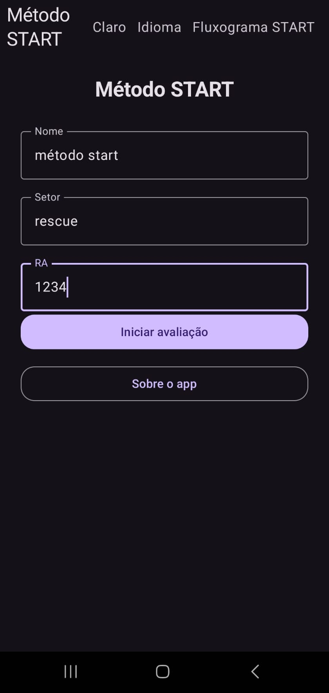
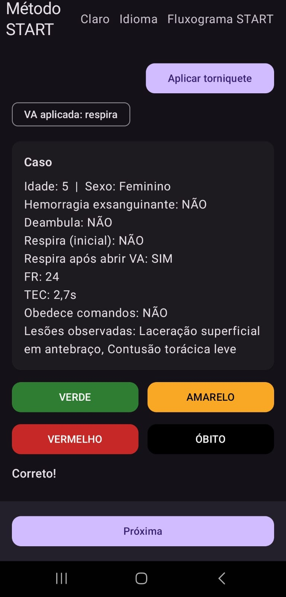
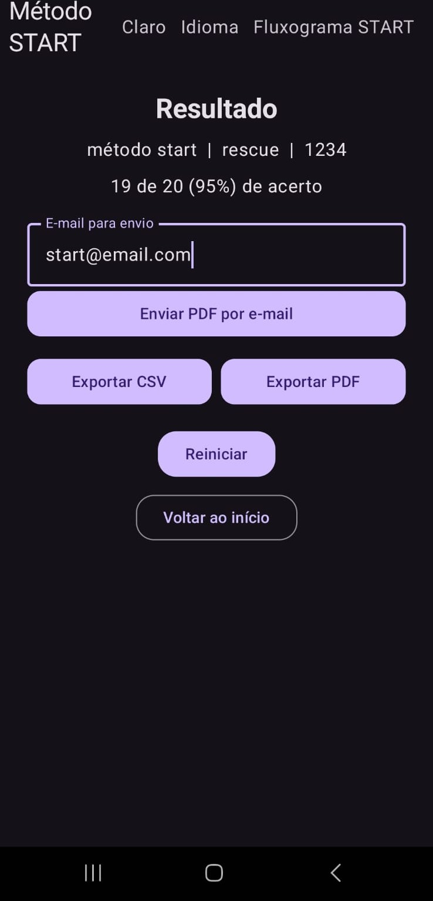
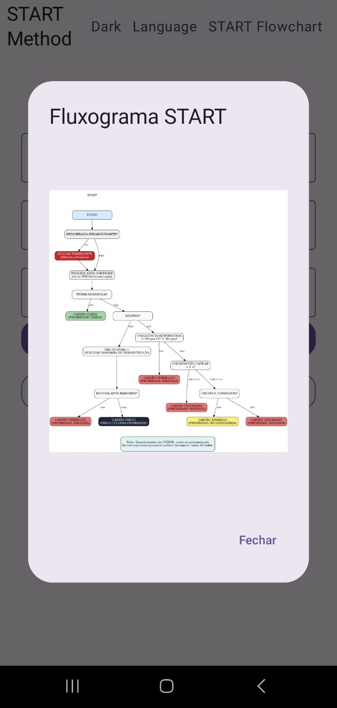

# StartRescue 🚑

Aplicativo Android para **simulação do protocolo START** (triagem em múltiplas vítimas) — focado em **educação e treinamento**.  
Feito em **Kotlin + Jetpack Compose**.

---

## ✨ Funcionalidades
- Fluxo START completo (deambula → respiração → FR → TEC/CRT → obediência a comandos)
- Hemorragia exsanguinante com **torniquete obrigatório**
- Abertura de vias aéreas (VA) com lógica de respiração pós-VA
- **TEC “Ausente/Absent”** quando não respira / sem circulação efetiva
- 20 questões com cronômetro e feedback
- Exportação de **PDF** e **CSV**
- Tema claro/escuro e **i18n (PT/EN)**

---

## 🖼️ Screenshots

<p align="center">
  <a href="docs/home.png"></a>
  <a href="docs/home-light.png"></a>
  <a href="docs/exam.png"></a>
</p>
<p align="center">
  <sub>Home (dark)</sub> &nbsp;&nbsp;&nbsp;&nbsp;
  <sub>Home (light)</sub> &nbsp;&nbsp;&nbsp;&nbsp;
  <sub>Exam (dark)</sub>
</p>

<p align="center">
  <a href="docs/exam-light-en.png"></a>
  <a href="docs/result.png"></a>
  <a href="docs/fluxograma.png"></a>
</p>
<p align="center">
  <sub>Exam (light, EN)</sub> &nbsp;&nbsp;&nbsp;&nbsp;
  <sub>Result</sub> &nbsp;&nbsp;&nbsp;&nbsp;
  <sub>START Flowchart</sub>
</p>

> Ajuste `width="320"` se quiser miniaturas maiores/menores.

---

## 🔗 Política de Privacidade
- Português: https://DevSold.github.io/startrescue-privacy/politica.html  
- English:  https://DevSold.github.io/startrescue-privacy/privacy.html

> A URL usada no app vem de `BuildConfig.PRIVACY_URL` (definida no Gradle).

---

## 🛠️ Tech
- Kotlin • Jetpack Compose (Material 3)
- ViewModel/State + corrotinas
- Geração de PDF/CSV nativa

---

## 📦 Build / Versão

Edite em `app/build.gradle.kts`:

```kotlin
android {
    namespace = "com.devstart.startrescue"
    compileSdk = 35

    defaultConfig {
        applicationId = "com.devstart.startrescue"
        minSdk = 24
        targetSdk = 35

        versionCode = 1        // ↑ aumente a cada release
        versionName = "1.0.0"  // exibido ao usuário

        // Política de Privacidade (GitHub Pages)
        buildConfigField(
            "String",
            "PRIVACY_URL",
            "\"https://DevSold.github.io/startrescue-privacy/politica.html\""
        )
    }

    buildFeatures { buildConfig = true }
}
